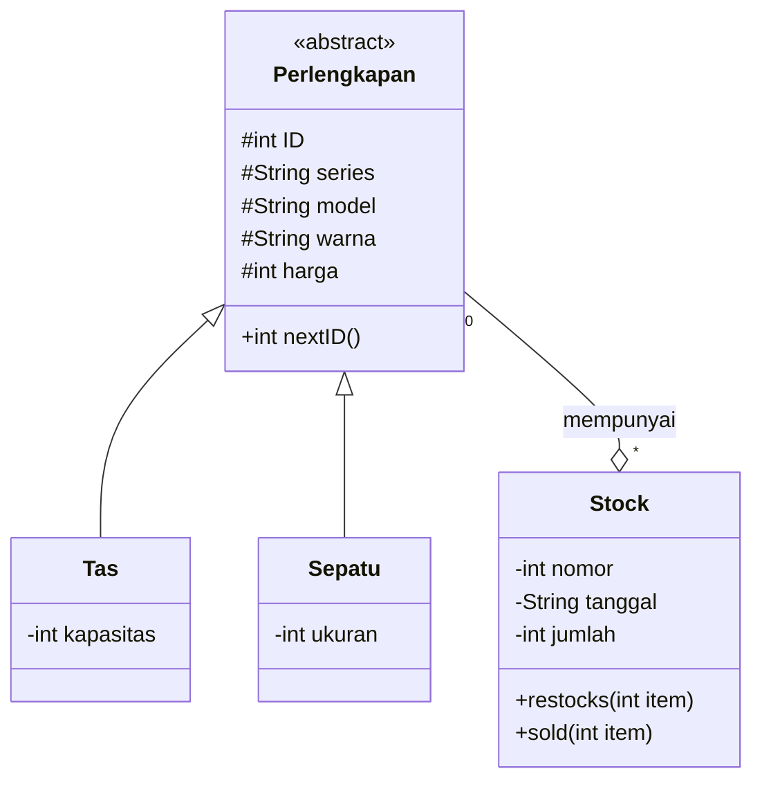
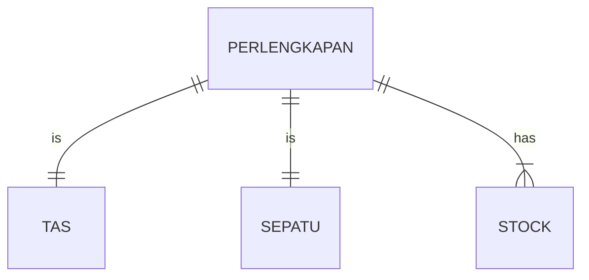
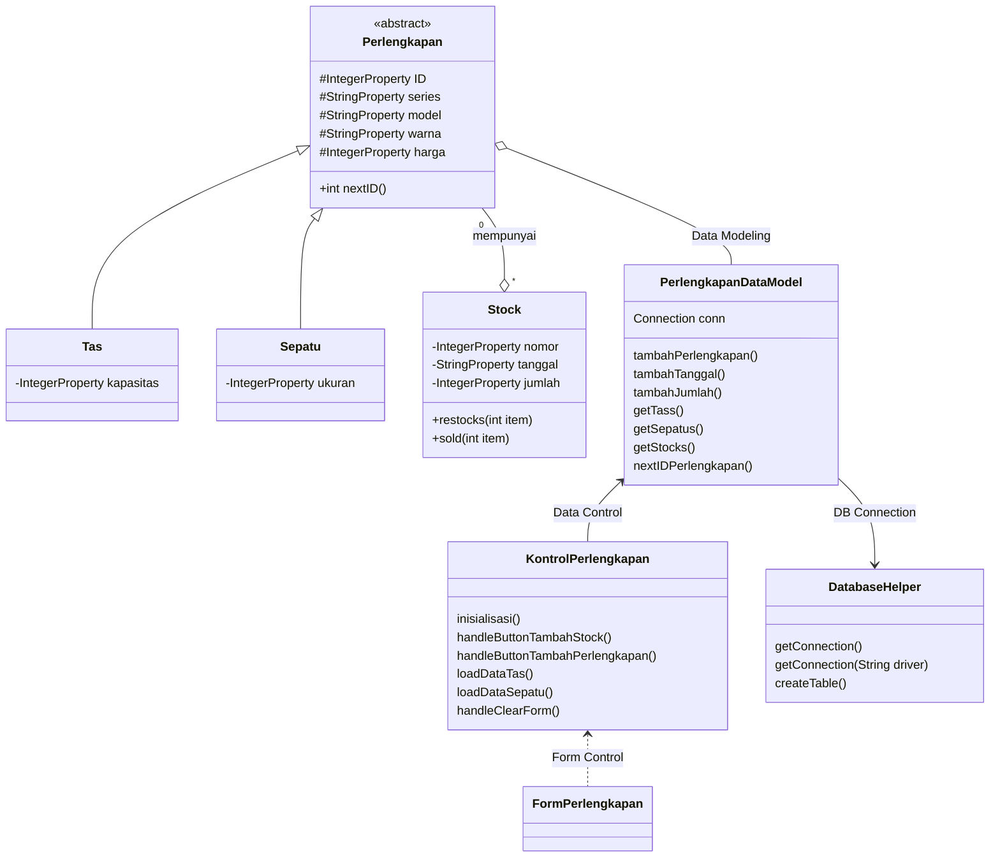

## :school_satchel: Sistem penambah data Toko Perlengkapan Sekolah :athletic_shoe:
> Sistem ini dapat melakukan perekaman data yang tersimpan dan menyimpan stock dari toko perlengkapan sekolah, di mana terdapat 2 perlengkapan yaitu sepatu dan tas.
> Setiap barang dapat di tambah stocknya.

:closed_book: Libraries dan Tools project:
- mysql-connector-java-5.1.49.jar
- sqlite-jdbc-3.340.jar
- Scene builder
- Sqlite studio
- MySQL server with xampp
- Netbeans editor
- VS code plugin
     - mermaid
     - GitHub Pull Requests and Issues

## :art: Design
### Class Diagram

### ER Diagram

### Design Class Diagram for JavaFX and Database

