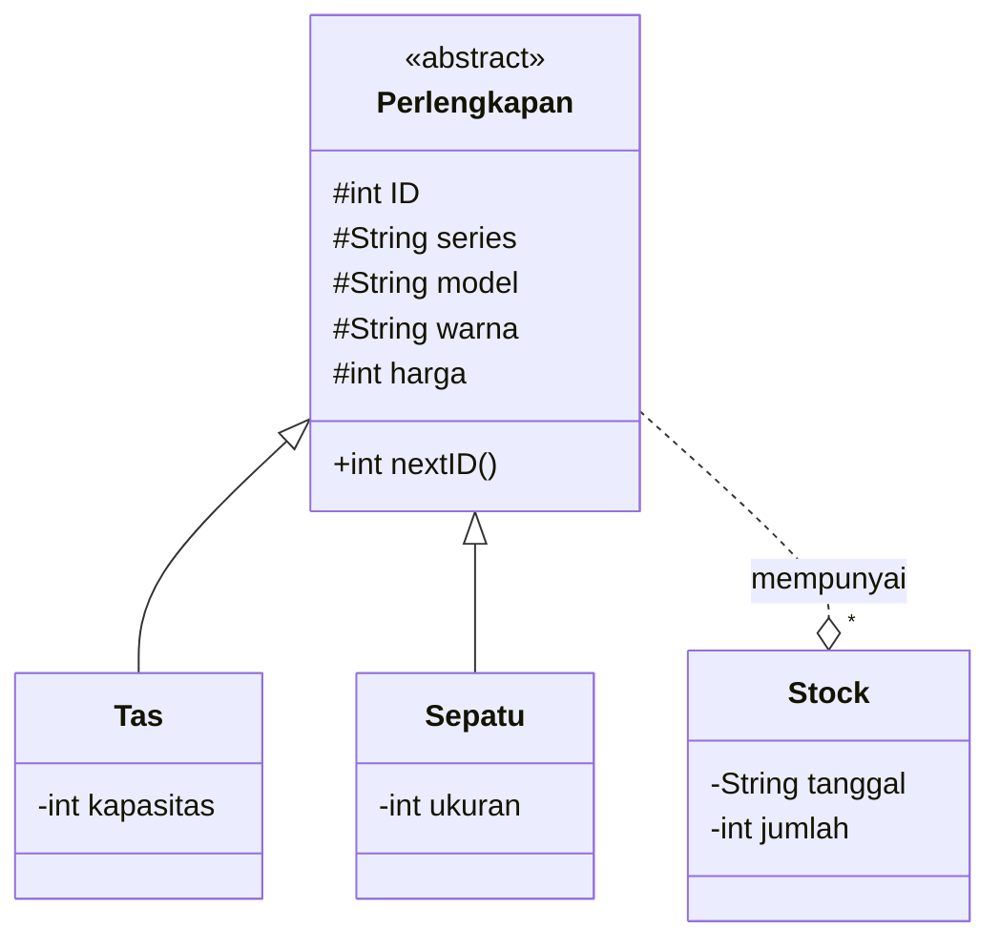

```mermaid
classDiagram
      Perlengkapan <|-- Tas
      Perlengkapan <|-- Sepatu
      Perlengkapan ..o"*" Stock : mempunyai

      class Perlengkapan{
        <<abstract>>
        #int ID
        #String series
        #String model
        #String warna
        #int harga
        +int nextID()
      }
      
      class Tas{
          -int kapasitas
      }
      class Sepatu{
          -int ukuran
      }
      class Stock{
          -String tanggal
          -int jumlah
      }
```		
