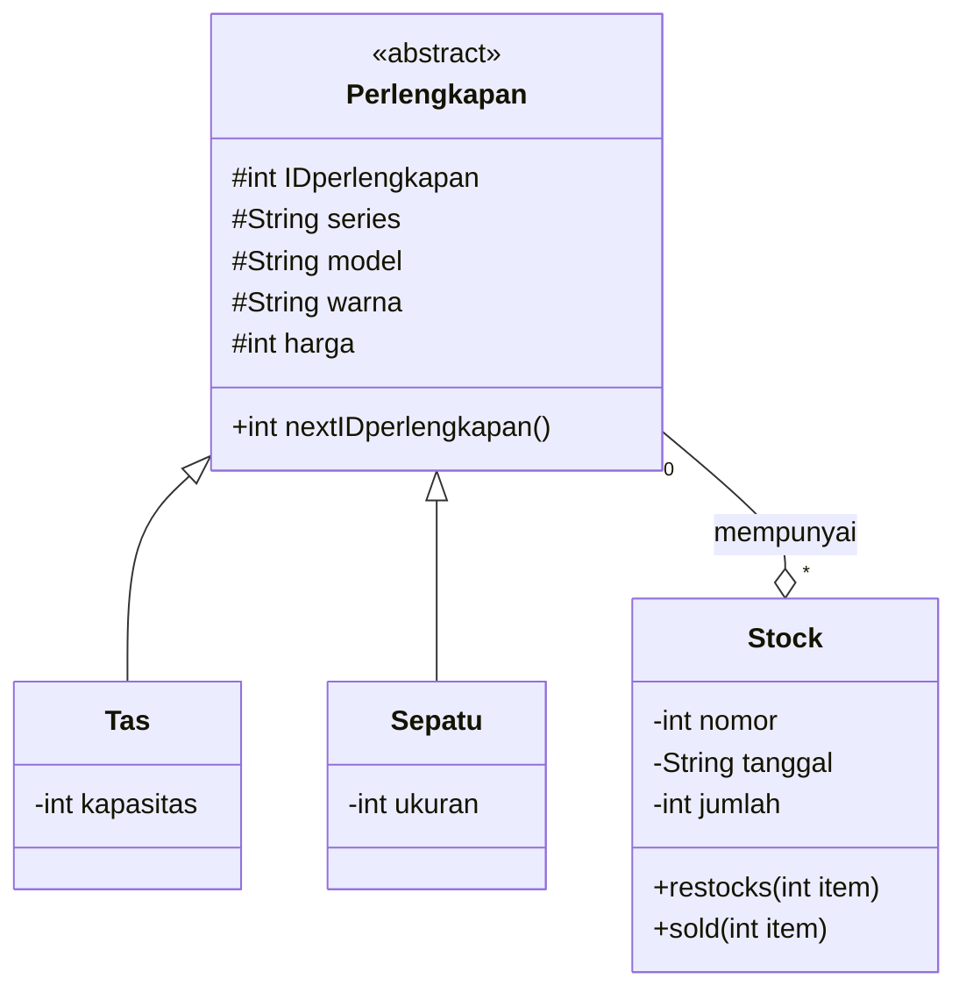
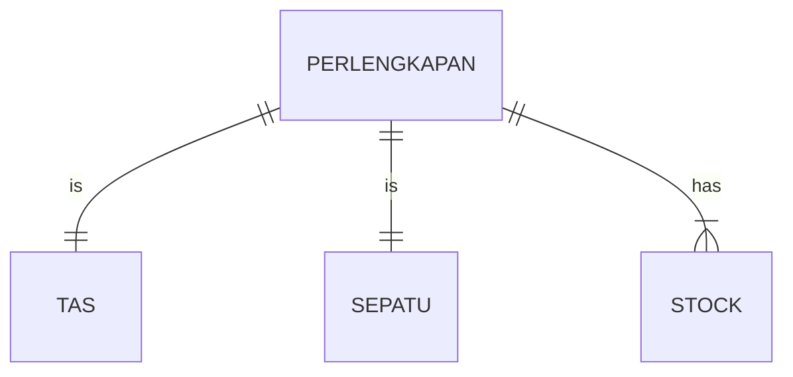
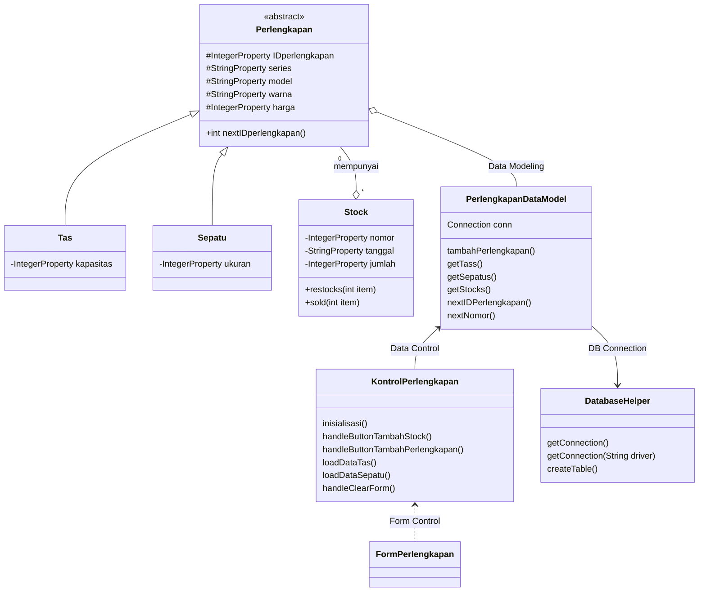

## Nama Anggota
> Anggie Tamara (1917051006)
> Faishal Hariz Makaarim Gandadipoera (1917051065)
> Program kami buat bersama-sama dengan berdiskusi online dan jika ada error dan kesalahan kami memperbaikinya bersama-sama (kami sama-sama mencari letak error dan jika salah satu dari kami berhasil, maka program diperbaiki). Untuk FormPerlengkapan.fxml dan KontrolPerlengkapan.java dibuat secara terpisah, kami sama-sama menambahkan jika ada yang kurang dan sebagainya.

# :school_satchel: Sistem Penambahan Data Toko Perlengkapan Sekolah :athletic_shoe:
> Sistem ini dapat melakukan perekaman data yang tersimpan dan menyimpan stock dari toko perlengkapan sekolah, di mana terdapat dua perlengkapan yaitu sepatu dan tas.
> Setiap barang dapat di tambah stocknya.

:books: Libraries dan Tools project:
- mysql-connector-java-5.1.49.jar
- sqlite-jdbc-3.340.jar
- Scene builder
- Sqlite studio
- MySQL server with xampp
- Netbeans editor
- VS code plugin
     - mermaid
     - GitHub Pull Requests and Issues

## :art: Design
> Untuk melihat diagram, install plugin mermaid-diagram di https://github.com/Redisrupt/mermaid-diagrams

### Class Diagram

### ER Diagram

### Design Class Diagram for JavaFX and Database

