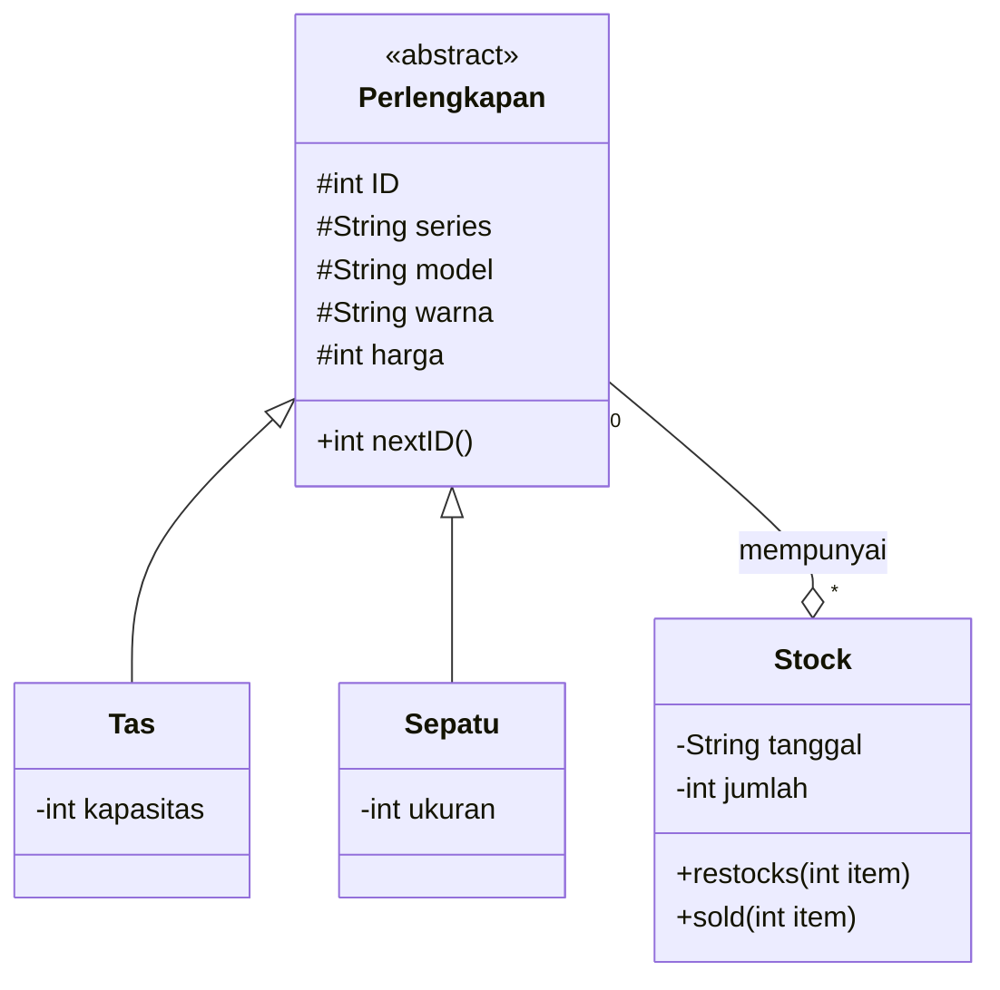
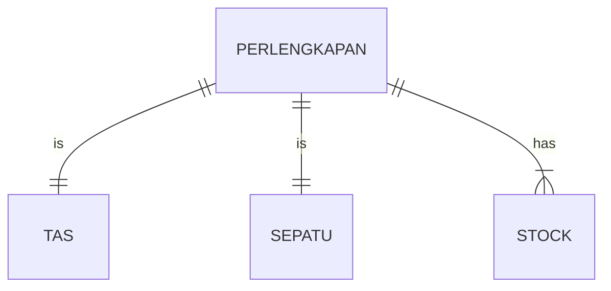
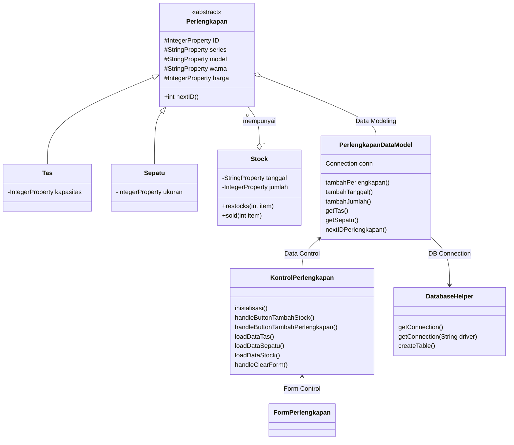

### Class Diagram

```mermaid
classDiagram
      Perlengkapan <|-- Tas
      Perlengkapan <|-- Sepatu
      Perlengkapan "0"--o"*" Stock : mempunyai

      class Perlengkapan{
        <<abstract>>
        #int ID
        #String series
        #String model
        #String warna
        #int harga
        +int nextID()
      }
      
      class Tas{
          -int kapasitas
      }
      class Sepatu{
          -int ukuran
      }
      class Stock{
          -String tanggal
          -int jumlah
          +restocks(int item)
          +sold(int item)
      }
```		

### ER Diagram

```mermaid
erDiagram
          PERLENGKAPAN ||--|| TAS : is
          PERLENGKAPAN ||--|| SEPATU : is
          PERLENGKAPAN ||--|{ STOCK : has
```

### Design Class Diagram for JavaFX and Database

```mermaid
classDiagram
      Perlengkapan <|-- Tas
      Perlengkapan <|-- Sepatu
      Perlengkapan "0"--o"*" Stock : mempunyai
      Perlengkapan o-- PerlengkapanDataModel : Data Modeling
      PerlengkapanDataModel <-- KontrolPerlengkapan : Data Control
      PerlengkapanDataModel --> DatabaseHelper : DB Connection
      KontrolPerlengkapan <.. FormPerlengkapan : Form Control

      class Perlengkapan{
        <<abstract>>
        #IntegerProperty ID
        #StringProperty series
        #StringProperty model
        #StringProperty warna
        #IntegerProperty harga
        +int nextID()
      }
      
      class Tas{
        -IntegerProperty kapasitas
      }
      class Sepatu{
        -IntegerProperty ukuran
      }
      class Stock{
        -StringProperty tanggal
        -IntegerProperty jumlah
        +restocks(int item)
        +sold(int item)
      }
      class PerlengkapanDataModel{
        Connection conn
        tambahPerlengkapan()
        tambahTanggal()
        tambahJumlah()
        getTas()
        getSepatu()
        nextIDPerlengkapan()
      }
      class KontrolPerlengkapan{
        inisialisasi()
        handleButtonTambahStock()
        handleButtonTambahPerlengkapan()
        loadDataTas()
        loadDataSepatu()
        loadDataStock()
        handleClearForm()
      }
      class DatabaseHelper{
        getConnection()
        getConnection(String driver)
        createTable()
      }
      class FormPerlengkapan{
      }
```
